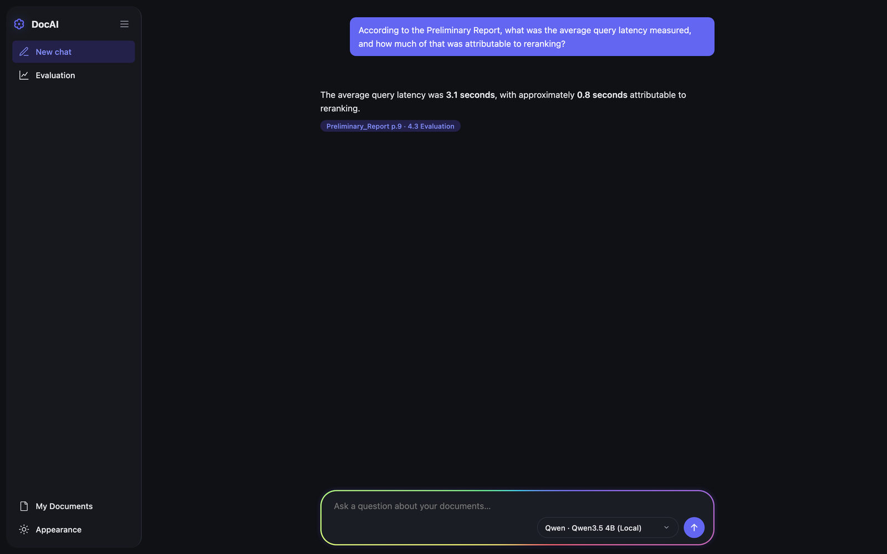
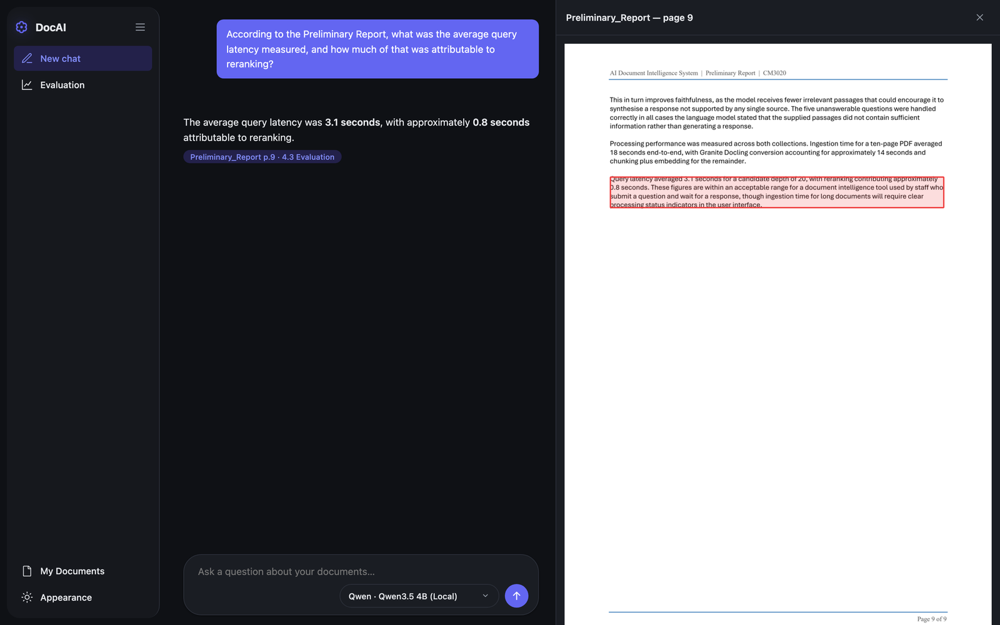
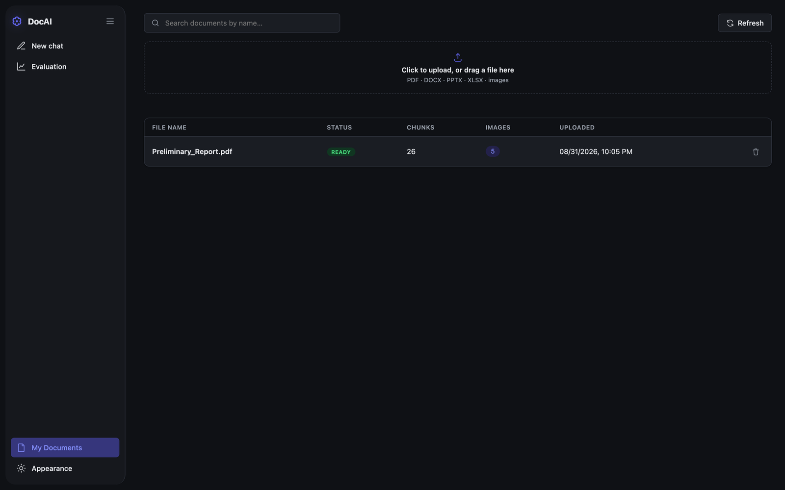
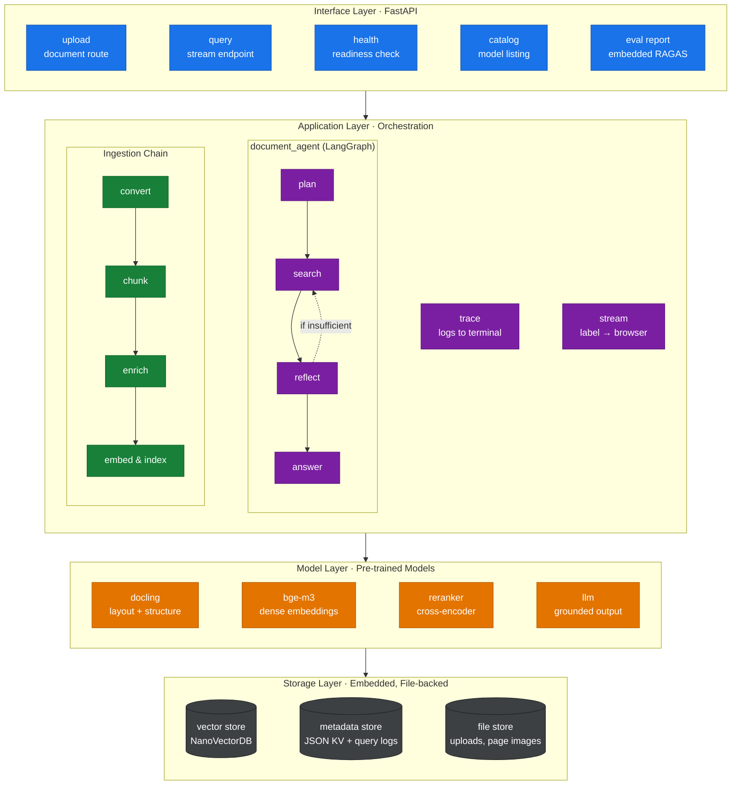
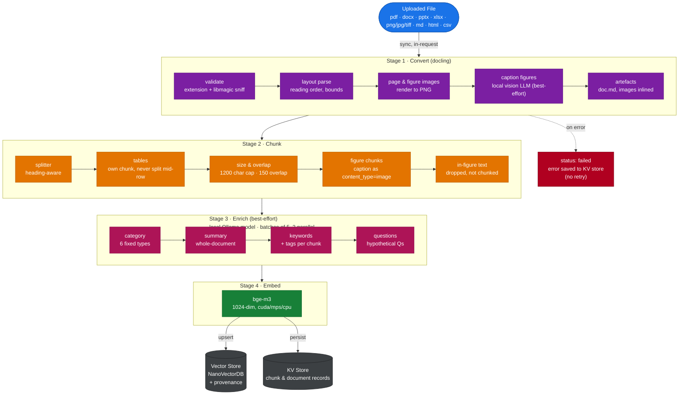
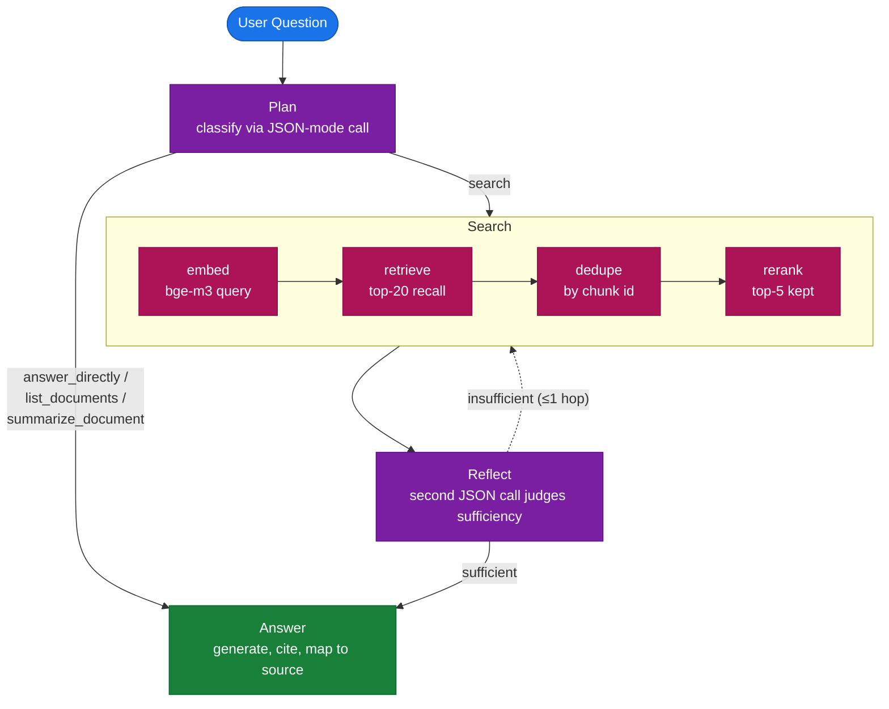

# DocAI

**A locally-deployable, multimodal document intelligence system.** Upload PDFs, Word docs, slides, spreadsheets, or scanned images; ask questions in plain English; get answers grounded in your documents with page-level, click-to-verify citations.

<p align="left">
  
  
  
  
  
</p>

Built for **CM3070 Final Project** (University of London), under **CM3020 Artificial Intelligence — Project Idea 1: *Orchestrating AI Models to Achieve a Goal***. Four pre-trained models — a layout-aware document converter, a dense retriever, a cross-encoder reranker, and a language model used in three distinct roles — are orchestrated into a single pipeline so a non-technical user can trust an answer without ever seeing an embedding, a vector store, or a prompt.

---

## Contents

- [Why DocAI](#why-docai)
- [Key Features](#key-features)
- [Screenshots](#screenshots)
- [Architecture](#architecture)
- [Document Ingestion Pipeline](#document-ingestion-pipeline)
- [Query Pipeline](#query-pipeline)
- [Tech Stack](#tech-stack)
- [Evaluation Highlights](#evaluation-highlights)
- [Requirements](#requirements)
- [Setup](#setup)
- [Running the Application](#running-the-application)
- [Model Providers](#model-providers)
- [Project Layout](#project-layout)
- [Troubleshooting](#troubleshooting)
- [Scope](#scope)
- [License](#license)

---

## Why DocAI

Keyword search fails the moment a question is phrased differently from the source text, and a flat text dump loses everything a table's rows and columns were encoding. DocAI converts a document once, keeps it searchable by *meaning* rather than exact wording, reranks candidates for precision before generation, and always shows exactly where an answer came from — so a guess can never be mistaken for a verified fact.

## Key Features

- **Layout-aware ingestion** — Docling preserves tables, headings, reading order, and page-level bounding boxes; a bad conversion never silently degrades the index.
- **Figure & image understanding** — every extracted figure is described by the LLM's vision capability and indexed as its own citable, searchable chunk.
- **Two-stage retrieval** — dense recall (`BAAI/bge-m3`) narrowed by cross-encoder reranking (`BAAI/bge-reranker-v2-m3`) before anything reaches the generator.
- **An actual decision agent, not a fixed chain** — a small LangGraph state machine (`document_agent`) classifies each question (answer directly / list documents / summarise a document / search), and can trigger one bounded follow-up search if the first retrieval pass looks thin.
- **Evidence-constrained generation with real citations** — every substantive claim carries an inline marker that resolves back to a specific document, page, and highlighted region.
- **Runs fully offline** — a project-managed local Ollama runtime plus Qwen3.5 4B by default; optional OpenRouter free-tier models as a cloud fallback, never required.
- **No external database** — NanoVectorDB + a hand-rolled, atomically-written JSON store; the entire knowledge base is one directory you can delete to reset.
- **Zero-build frontend** — a static single page served directly by FastAPI, no npm, no bundler.
- **Built-in evaluation harness** — RAGAS-scored, multi-provider, multi-category comparison, viewable from inside the running app.

## Screenshots

| Chat, with a source-backed answer | Click-to-verify citation preview |
|---|---|
|  |  |

Clicking a citation chip opens the exact source page and highlights the precise region the answer was generated from — reconstructed from the bounding box Docling records at conversion time.

<details>
<summary>Document management view</summary>



</details>

## Architecture

The system is organised into four layers, each with a defined input/output contract, so any single stage (the reranker, the generation model, the storage backend) can be replaced without touching the others.



No external database service is required — the whole knowledge base lives under one directory and can be reset by deleting it. The browser talks only to the FastAPI backend. Provider URLs and allowlisted model IDs are resolved server-side (`backend/config.py`); the frontend only ever sends a public model id, so a request can never turn the server into a proxy for an arbitrary host.

## Document Ingestion Pipeline

Every uploaded file (PDF, DOCX, PPTX, XLSX, PNG/JPG/TIFF, Markdown, HTML, CSV) is validated against both its extension and its actual byte content (via `libmagic`) before conversion begins. It then proceeds through a fixed, logged sequence — processed synchronously within the upload request, with no background job queue: layout-aware conversion, structure-aware chunking (tables always kept whole, headings used as split points), best-effort enrichment (category, summary, keywords, hypothetical questions — never blocking if it fails), then embedding and indexing. A conversion failure is recorded as `status: failed` with the error message in the KV store; there is no automatic retry.



Enrichment classifies each document into one of six fixed categories (policy, manual, contract, report, FAQ, other) and runs on a local `qwen3.5:4b` model via Ollama (JSON-mode, temperature 0) — deliberately decoupled from the user-selected chat model — in batches of five chunks, up to two batches concurrently, sharing GPU headroom with the figure-captioning calls from Stage 1. Embeddings are produced by `bge-m3` (1024 dimensions) on whichever device is available (CUDA, MPS, or CPU).

## Query Pipeline

Rather than a single always-retrieve-then-generate chain, every question is routed through an explicit decision graph (`document_agent`, built with LangGraph). A classification step avoids retrieval entirely for greetings or document-listing questions; a reflect step can trigger one bounded follow-up search if the first pass looks insufficient — with a hop counter that guarantees termination regardless of what the model decides.



State carried across every node: original question · selected model · hop counter · current action · active search query · sufficiency flag · accumulated chunks.

## Tech Stack

| Layer | Component | Role |
|---|---|---|
| Conversion | **Docling** (Granite Docling 258M) | Layout-aware conversion: tables, headings, reading order, page/figure provenance. |
| Retrieval | **BAAI/bge-m3** | Dense, multilingual, long-passage (8192-token) embeddings for first-stage recall. |
| Reranking | **BAAI/bge-reranker-v2-m3** | Cross-encoder that jointly scores query + passage for second-stage precision. |
| Generation & Agent | **Qwen3.5 4B** (local, via project-managed Ollama) or an allowlisted **OpenRouter** free-tier model | Answer generation with citations, agent routing/reflection decisions, and figure description — three roles, one model interface. |
| Orchestration | **FastAPI** + **LangGraph** | Async API layer; `document_agent` state machine for query routing. |
| Storage | **NanoVectorDB** + a custom atomic **JSON KV store** + plain file store | Embedded, file-backed, no external database service. |
| Frontend | Vanilla JS + marked.js/DOMPurify + mermaid.js + Chart.js (CDN) | Zero-build static single-page UI. |

## Evaluation Highlights

Full methodology, ablation design, and per-category breakdowns are in the [final report](../Docs/Final/Final_Report/Final_Report.pdf) (Chapter 5) and the [evaluation harness README](eval/README.md). Headline results from the 12-question × 5-provider (60-case) run:

- **Local Qwen 3.5 4B is the most faithful full-pipeline candidate (0.95 faithfulness)** and the only one with zero non-transient errors, across four independently-sourced generation models sharing identical retrieval code.
- **The reranker measurably helps** — faithfulness +0.02 and a real precision gain concentrated in `factual_lookup` (+0.27) and `multi_hop` (+0.37) questions — but it is **not a uniform win**: it's roughly neutral on `table_cell` and actively hurts `named_section` retrieval, at a real cost of ~64 seconds per query.
- **Reranking reorders, it doesn't change, the retrieved set** — context recall is identical to two decimal places with the reranker on vs. off, across every question category.
- **`table_cell` retrieval is the clearest known limitation** — the weakest category for every generation model tested, a genuine chunking/embedding gap for row-and-column content rather than a scoring artefact.

Run it yourself:

```bash
cd eval
python run_eval.py --quick    # 4 questions × 5 providers, a fast sanity check
python run_eval.py --full     # 12 questions × 5 providers, the full reported run
```

The results are also viewable from inside the running app via the **Evaluation** sidebar button.

## Requirements

- Python 3.10
- Windows 10 22H2+ (64-bit x86), or macOS 14+ (Apple Silicon)
- Internet access for first-time dependency and model downloads
- Recommended: 24 GB RAM, 15–20 GB free disk space

The local Ollama runtime, Qwen model, Hugging Face cache, logs, and vector data are stored under git-ignored runtime folders.

## Setup

### macOS

```bash
cd Doc_Intelligent_App
python3.10 -m venv .venv
source .venv/bin/activate
python -m pip install -r requirements.txt
cd backend
python api.py
```

### Windows (PowerShell)

```powershell
cd Doc_Intelligent_App
py -3.10 -m venv .venv
.\.venv\Scripts\python.exe -m pip install -r requirements.txt
cd backend
..\.venv\Scripts\python.exe api.py
```

Or simply run `./run.sh` (macOS) / `./run.ps1` (Windows) from `Doc_Intelligent_App/`, which installs dependencies and launches the app using the project's own virtualenv every time.

On first run, `backend/api.py` automatically checks for the pinned project-local Ollama runtime and `qwen3.5:4b-q4_K_M`, downloading them into `.runtime/` if missing:

| Download | Approx. size |
|---|---|
| Ollama runtime (macOS / Windows) | 154 MB / 1.46 GB |
| Qwen3.5 4B local model | 3.4 GB |
| Embedding + reranking models (first use) | ~2 GB each |

## Running the Application

```bash
cd Doc_Intelligent_App/backend
python api.py
```

- FastAPI: `http://127.0.0.1:8000`
- Project-managed local Ollama: `http://127.0.0.1:11435`

Open `http://127.0.0.1:8000`, upload a document, wait for it to reach **Ready**, pick an available model, and ask a question.

> **Note:** run through `python api.py`, not `uvicorn api:app` directly — direct Uvicorn startup skips the automatic local Ollama install/start step.

## Model Providers

### Local Qwen (via Ollama) — default, no API key needed

The app downloads and manages its own pinned Ollama runtime inside `.runtime/`, fixed to port `11435` (a normal system-wide Ollama install on `11434` is not used).

### OpenRouter — optional cloud fallback

The app runs fully offline without this. To enable it:

1. Copy `backend/.env.example` to `backend/.env`.
2. Add your own key: `OPENROUTER_API_KEY=sk-or-v1-...` (free at [openrouter.ai/keys](https://openrouter.ai/keys)).
3. Start the app as usual — `config.py` loads `backend/.env` automatically via `python-dotenv`.

`backend/.env` is git-ignored and must never be committed. Leaving it unset is a fully supported state: the app simply reports OpenRouter models as unavailable in the model picker.

## Project Layout

```text
Doc_Intelligent_App/
  frontend/
    index.html, app.js, style.css, startup.html   Static single-page UI, no build step.

  backend/
    api.py                    FastAPI routes, startup sequencing, streaming query endpoint.
    config.py                 Paths, model catalog/allowlist, provider config, pipeline tuning.
    prompt.yaml                Every prompt used in the app, in one file.
    pipeline_trace.py         Structured step logging + stage labels streamed to the browser.

    agent/
      graph.py                 document_agent: the LangGraph query decision graph.

    ingestion/
      converter.py             Docling conversion, bbox coordinate conversion.
      chunker.py                Heading-aware, table-safe chunking.
      enrichment.py             Best-effort category/summary/keyword extraction.
      pipeline.py                Upload → convert → chunk → enrich → embed → index.

    retrieval/
      embedder.py, reranker.py, pipeline.py   Two-stage retrieval.

    generation/
      llm.py                    Provider-agnostic generation, citation mapping, error mapping.
      ollama/                    Portable local Ollama install/lifecycle management.

    storage/
      vector_store.py           NanoVectorDB wrapper.
      kv_store.py                 Atomic, crash-safe JSON KV store.
      file_store.py               Uploaded-file storage, keyed by generated id.

    knowledge_base/             Git-ignored: uploads, vector/metadata db, logs, page/figure images.

  eval/                          RAGAS-scored evaluation harness — see eval/README.md.
  sample_documents/              Sample PDF used by the evaluation harness.
  requirements.txt
```

## Troubleshooting

**Local Qwen is unavailable** — run via `python api.py`, not direct Uvicorn. If port `11435` is already in use, stop that process and restart; the launcher won't reuse or kill an unrelated process.

**First startup takes a long time** — expected on a new machine while Python packages, the portable Ollama runtime, Qwen, and the embedding/reranking models download.

**OpenRouter is unavailable** — check `backend/.env` exists and `OPENROUTER_API_KEY` is set (see [Model Providers](#model-providers)). Local Qwen continues to work regardless.

## Scope

This project favours a small, bounded, fully-auditable decision graph over open-ended agentic tool selection: `document_agent` picks from exactly four fixed actions and can loop at most once, with every decision logged and a safe fallback if a routing call fails to parse. The goal throughout was to keep each model stage testable and swappable in isolation — which is also what makes the reranker ablation in the evaluation possible at all — rather than to build multi-tenant infrastructure or an unconstrained autonomous agent.

## License

This is a University of London CM3070 coursework submission. No open-source license is currently granted — please contact the author before reusing any part of this code.
