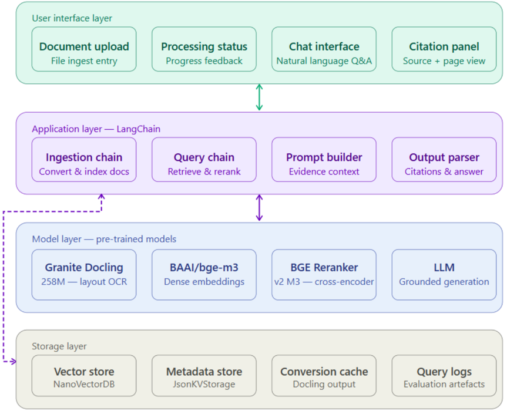
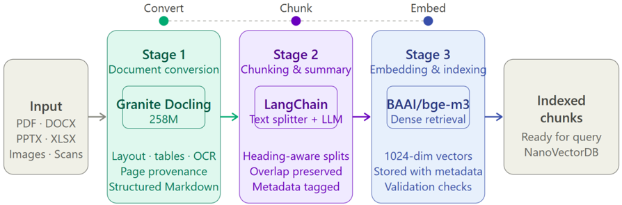
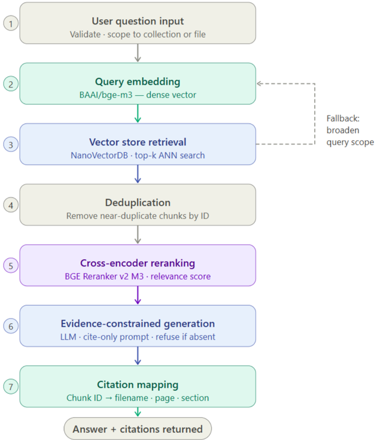
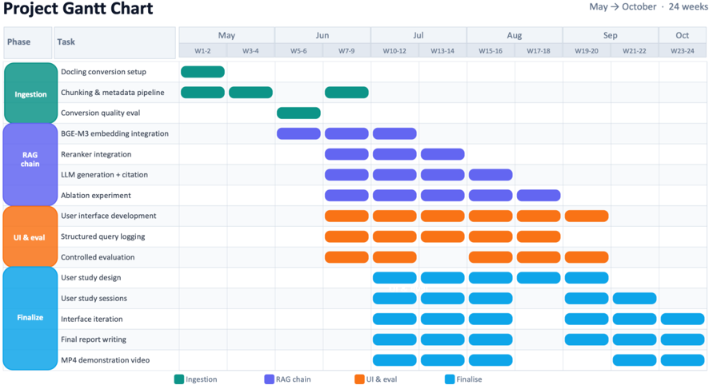
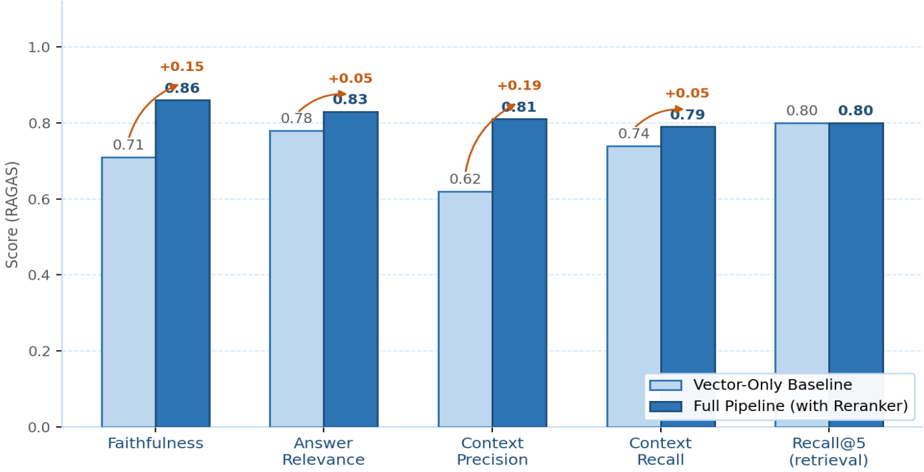

## AI DOCUMENT INTELLIGENCE SYSTEM

## Preliminary Report

CM3020 Artificial Intelligence Project Idea 1: Orchestrating AI Models to Achieve a Goal

June 2026

Authored by: WOO WEI HWANG

## Table of Contents

| Chapter 1: Introduction............................................................................................ 3              |
|------------------------------------------------------------------------------------------------------------------------------------|
| 1.1 Background and Motivation .........................................................................................3           |
| 1.2 Project Aims and Objectives........................................................................................3           |
| 1.3 Project Template and Model Orchestration ..................................................................4                   |
| Chapter 2: Literature Review.................................................................................... 5                 |
| 2.1 Retrieval-Augmented Generation.................................................................................5               |
| 2.2 Dense Embedding Models for Document Retrieval .......................................................5                         |
| 2.3 Cross-Encoder Reranking............................................................................................6           |
| 2.4 Multimodal Document Understanding .........................................................................6                   |
| 2.5 Evaluation of Retrieval-Augmented Generation Systems ..............................................7                           |
| Chapter 3: Design.................................................................................................... 8            |
| 3.1 System Architecture Overview.....................................................................................8             |
| 3.2 User and Document Scope..........................................................................................9             |
| 3.3 Document Ingestion Pipeline..................................................................................... 10            |
| 3.4 Query Pipeline .......................................................................................................... 11   |
| 3.5 Technology Stack...................................................................................................... 12      |
| 3.6 Work Plan................................................................................................................. 13  |
| Chapter 4: Feature Prototype ..................................................................................14                  |
| 4.1 Prototype Description ............................................................................................... 14       |
| 4.2 Implementation and Challenges................................................................................ 14               |
| 4.3 Evaluation ................................................................................................................ 14 |
| 4.4 Critical Evaluation and Planned Improvements.......................................................... 16                      |
| References.............................................................................................................17          |

## Chapter 1: Introduction

## 1.1 Background and Motivation

Organisations of all sizes accumulate heterogeneous document collections that span PDFs, Word documents, PowerPoint presentations, spreadsheets, scanned forms, and images. Critical operational information is routinely distributed across lengthy files in tables, section headings, multi-column layouts, and figure captions. Staff consequently invest substantial time opening individual files, cross-referencing passages, and manually verifying that a retrieved sentence actually supports the answer they need. This inefficiency represents a measurable productivity cost that has proven resistant to conventional software solutions.

Keyword-based search is inherently limited because it depends on lexical overlap between query and document. A user who phrases a question differently from the source text may retrieve nothing useful, while relevant information buried in a table or a scanned page may not surface at all. The problem is compounded when an organisation stores documents in multiple formats with inconsistent structure a critical figure may appear only in a spreadsheet cell, a policy condition only in a table footnote, or a contractual obligation only in a slide caption. Reliable document intelligence therefore requires two capabilities that keyword search cannot provide the faithful interpretation of heterogeneous file formats including their visual and structural layout, and the ability to match queries to content based on meaning rather than exact terms.

Retrieval-augmented generation addresses this gap by coupling a language model with an information retrieval component. Rather than relying solely on knowledge encoded during pre-training, a RAG system retrieves relevant passages from a document corpus at query time and provides them as grounding evidence for the generated answer. This architecture permits the system to work with private, proprietary, or recently updated documents that the language model has never encountered, and it enables each answer to be traced back to specific passages and pages. However, naive RAG implementations frequently fail in enterprise settings document conversion that loses table structure degrades the quality of indexed content; single-stage vector retrieval may miss the most relevant passage owing to phrasing mismatch; and an unconstrained language model may synthesise an answer that sounds plausible but is not supported by any retrieved evidence.

This project is motivated by these practical shortcomings. It proposes a multimodal AI document intelligence system that processes heterogeneous enterprise files, preserves page-level provenance throughout the pipeline, retrieves evidence semantically, reranks candidate passages before generation, and returns answers with traceable source citations. The contribution is not a new retrieval algorithm but a carefully engineered and evaluated orchestration of pre-trained models that together solve a clearly defined user problem. The system is designed to be locally deployable, deterministic in its processing sequence, and measurable at each stage of the pipeline.

The intended users are non-technical employees who require reliable answers from internal documents without navigating raw files or understanding the underlying models. Representative tasks include locating a specific policy clause, comparing two contract schedules, retrieving a numerical figure from a technical report, and confirming whether a procedure document covers a particular scenario. For each query, the system returns a concise answer together with the originating document title, page range, and the retrieved supporting passages, enabling users to verify important claims independently.

## 1.2 Project Aims and Objectives

The primary aim is to design, implement, and evaluate a locally deployable AI document intelligence application that converts heterogeneous documents into searchable evidence base and produces grounded answers with traceable citations. The project investigates whether a carefully orchestrated multimodal RAG pipeline can deliver reliable, source-cited retrieval across structurally distinct document collections without per-domain engineering changes.

The objectives are as follows.

1. First, to analyse user requirements and define realistic question-answering tasks representative of enterprise document use.
2. Second, to implement a LangChain-based RAG workflow covering document ingestion, semantic retrieval, cross-encoder reranking, answer generation, and source citation.
3. Third, to integrate Granite Docling 258M as a pre-trained multimodal model for layout-aware document conversion that preserves tables, headings, reading order, and page provenance.
4. Fourth, to integrate BGE-M3 for first-stage dense retrieval and BGE reranker v2 M3 for second-stage relevance scoring.
5. Fifth, to evaluate the pipeline rigorously at each stage using controlled experiments, automated metrics, and a small user study.

## 1.3 Project Template and Model Orchestration

This project is submitted under CM3020 Project Idea 1: Orchestrating AI Models to Achieve a Goal. The overall goal is to enable non-technical users to query heterogeneous document collections and receive reliable, source-grounded answers. The system is an integrated pipeline in which the output of each model becomes the input to the next stage it is not a collection of independent model demonstrations.

Four pre-trained models are orchestrated within the pipeline. Granite Docling 258M interprets visually complex document pages and produces structured content including text, headings, tables, reading order, and page references. BGE-M3 encodes document chunks and user queries as dense vectors, enabling efficient first-stage retrieval based on semantic similarity. BGE reranker v2 M3 scores each query-passage pair jointly using a cross-encoder architecture, reordering the initial candidate set by fine-grained relevance. A large language model then generates the final answer constrained by the selected evidence passages, with inline citation markers mapped to document metadata.

Table 1: summarises each model's role and its corresponding evaluation approach.

| Pre-trained Model           | Input → Output                            | Role in Workflow                                                        | Evaluation Approach                                                             |
|-----------------------------|-------------------------------------------|-------------------------------------------------------------------------|---------------------------------------------------------------------------------|
| Granite Docling258M         | Document image/layout→ structured content | Layout-aware conversion preserving tables, headings and page provenance | ∞ Conversion success rate ∞ reading-order accuracy ∞ table-structure inspection |
| BAAI/bge-m3                 | Text →semantic vectors                    | First-stage dense retrieval over indexed document chunks                | ∞ Recall@k ∞ MRR ∞ Latency ∞ comparison with alternative embedding model        |
| BAAI/bge-reranker-v2- m3    | Query + passage→ relevance score          | Second-stage reranking of retrieved candidates                          | ∞ Context precision ∞ nDCG@k ∞ ablation versus vector-only baseline             |
| LLM (API, version recorded) | Evidence + query →cited answer            | Evidence-constrained answer generation with source citation             | ∞ RAGASfaithfulness ∞ answer relevance ∞ manual citation review                 |

Table 1: Model Orchestration Matrix

## Chapter 2: Literature Review

## 2.1 Retrieval-Augmented Generation

Large language models generate fluent, contextually appropriate text but are prone to producing factually unsupported statements when queried beyond their training distribution. They also cannot access an organisation's private, proprietary, or recently updated documents, because their knowledge is fixed at training time. Retrieval-augmented generation (RAG) addresses both limitations by retrieving relevant passages from an external corpus at query time and supplying them as grounding context for the language model. Lewis et al. (2020) introduced the foundational architecture combining a parametric memory, the language model, with a non-parametric memory, the retrieval index, allowing factual answers to be conditioned on retrieved evidence rather than solely on model parameters. This separation is architecturally significant because it means the knowledge base can be updated by modifying the document index without retraining the language model, making the system practical for organisations whose document collections change frequently.

Subsequent work has refined the original formulation substantially. Fan et al. (2024) survey the spectrum from naive RAG, which performs a single retrieval step followed immediately by generation, to advanced pipelines incorporating query rewriting, metadata filtering, multi-stage retrieval, and structured evaluation. Naive RAG is appropriate for simple factual lookups over clean, homogeneous corpora, but enterprise documents present conditions that expose its limitations directly questions phrased differently from the source text, answers distributed across tables and structured sections, and content encoded in heterogeneous formats that require faithful conversion before indexing. Advanced RAG designs address these conditions by adding retrieval stages, reranking, and evaluation checkpoints throughout the pipeline.

This project adopts an advanced RAG design such as layout-aware document conversion, structurepreserving chunking, dense vector retrieval, cross-encoder reranking, and evidence-constrained generation. The workflow is deliberately deterministic rather than agentic. Dynamic tool selection and autonomous agent architectures can handle broader and less predictable query types, but they make controlled evaluation substantially harder because the sequence of model calls is not fixed.

A deterministic chain ensures that the same uploaded document, configuration, and question always follow the same processing sequence, enabling reproducible ablation studies and clear attribution of failures to specific pipeline stages. This predictability is also valuable from a user trust perspective users of an enterprise document tool are more likely to rely on a system whose behaviour they can understand and verify than on one that selects its own processing path dynamically.

A central trade-off in RAG design concerns retrieval breadth versus generation precision. Retrieving too few candidates' risks omitting the answer passage entirely; retrieving too many introduces noise that can distract the language model and reduce faithfulness. The literature motivates a two-stage approach in which a broad, recall-oriented first stage retrieves a large candidate set quickly, and a more discriminative second stage reranks that set before generation. The final answer prompt should instruct the model to distinguish evidence-supported statements from uncertain inference, and to declare explicitly when the supplied passages do not contain sufficient information to answer the question.

## 2.2 Dense Embedding Models for Document Retrieval

Dense retrieval encodes both queries and document passages as continuous vectors in a shared semantic space, allowing retrieval to be performed by approximate nearest-neighbour search over pre-computed document embeddings. Unlike keyword-based methods such as BM25, which depend on exact term overlap, dense retrieval can surface passages that express the same information with entirely different vocabulary. Biencoder architectures process queries and passages independently, enabling document embeddings to be computed once at indexing time and reused efficiently for any subsequent query.

Three embedding models were evaluated before selecting BGE-M3. Sentence-transformers/all-MiniLM-L6-v2 was the first candidate. It is lightweight, fast, and widely used, with a 384-dimensional output vector and low memory requirements. However, its relatively small architecture limits its ability to represent domainspecific vocabulary and long passages. When tested against policy documents containing specialised regulatory terminology, retrieval recall dropped noticeably for paraphrased questions, and the model struggled to produce discriminative embeddings for table-dense sections where the semantic content is encoded in cell relationships rather than natural prose. These limitations made it unsuitable as the primary retrieval model for a heterogeneous enterprise corpus.

OpenAI text-embedding-ada-002 was the second candidate. It achieves strong performance on standard retrieval benchmarks and produces 1536-dimensional embeddings that capture nuanced semantic relationships. However, using it would introduce an external API dependency for every indexing and query operation, creating latency variability, per-token billing costs that scale with corpus size, and data-privacy concerns when indexing proprietary internal documents. Given that local deploy ability is a core design requirement for this project, a model that cannot operate without an external cloud service was rejected at the selection stage regardless of its retrieval quality.

BAAI/bge-m3 was selected as the embedding model. It supports passages up to 8192 tokens, accommodating the long sections common in policy and technical documents without requiring aggressive chunking that would fragment answer passages across multiple chunks. It is trained on a diverse multilingual corpus using a retrieval-specific objective and produces 1024-dimensional embeddings that generalise well to domain-specific terminology. Crucially, it runs locally on commodity hardware without an API dependency. Its selection is nonetheless treated as an engineering hypothesis rather than an assumed optimum the final evaluation will compare it against at least one alternative configuration using the same corpus, chunking settings, and question set.

## 2.3 Cross-Encoder Reranking

A bi-encoder retriever produces embeddings independently for the query and each passage, which limits its sensitivity to fine-grained lexical or positional matches between the two texts. A passage may share high cosine similarity with a query because it covers the same topic without containing the specific value, date, or condition the question requires. A cross-encoder reranker addresses this limitation by receiving the query and a candidate passage concatenated as a single input and producing a scalar relevance score, allowing the model to attend jointly to both texts and recognise detailed correspondences that a bi-encoder cannot capture.

This accuracy advantage comes at a computational cost. A cross-encoder must perform a full forward pass for each query-candidate pair, making it impractical as a primary retrieval mechanism over a large corpus. The standard solution is a two-stage pipeline the bi-encoder retrieves a manageable candidate set in milliseconds using approximate nearest-neighbour search, and the cross-encoder then reranks only that smaller set. This design concentrates expensive computation where it contributes most, at the final ranking decision before the language model receives its input context.

BAAI/bge-reranker-v2-m3 is used at the second stage. It was selected because it is trained on the same data distribution as BGE-M3, reducing the risk of systematic misalignment between the two stages, and because it supports the same long-passage inputs that make BGE-M3 suitable for enterprise documents. An alternative considered was cross-encoder/ms-marco-MiniLM-L-6-v2, which offers substantially lower inference latency but is trained primarily on web search queries and short passages.

## 2.4 Multimodal Document Understanding

Enterprise documents frequently encode critical information in structures that raw character extraction cannot preserve. Tables express conditions, quantities, owners, and exceptions through the positional relationship of cells, rows, and columns; linearising table text destroys this relational meaning. Multi-column layouts, presentation slides, scanned forms, spreadsheets, and figures with embedded annotations present similar challenges. A document pipeline that discards layout information produces indexed content that may be incomplete, misleading, or impossible to retrieve for questions that depend on structural relationships rather than keyword co-occurrence Several document processing tools were evaluated before selecting the conversion approach. PyMuPDF and pdfplumber both provide fast text extraction with partial support for simple tables. In testing on policy documents with two-column layouts, PyMuPDF merged text from adjacent columns into a single interleaved stream that was unusable for retrieval. Pdfplumber handled single-column tables adequately but produced incorrect cell alignment for tables with merged headers, and it provides no reading-order guarantee for pages with non-linear layout. Neither tool offers a visual understanding model both rely on heuristic parsing of the PDF character stream, which fails when document layout information is implicit in the page rendering rather than explicitly encoded in the file structure.

Adobe PDF Extract API offers strong layout understanding through a cloud-based visual model. Testing showed substantially better table fidelity compared with the heuristic tools, including correct handling of merged headers and multi-column text. However, the service requires a cloud connection for every conversion operation, introduces per-page billing that scales linearly with corpus size, and sends document content to an external server. This conflicts directly with the project's local-deployment and data-privacy requirements, since an enterprise document intelligence tool must be able to handle commercially sensitive content without transmitting it to a third party. The API was therefore rejected despite demonstrating the strongest raw conversion quality of the candidates tested.

Docling with the Granite Docling 258M pre-trained model was selected. Granite Docling interprets document pages visually using a multimodal neural architecture, preserves table structure as structured Markdown, maintains reading order across complex layouts, and operates entirely locally. The distinction between Docling, the application-level conversion framework, and Granite Docling 258M, the pre-trained model that performs visual page interpretation, is important for accurately representing the AI contribution within the CM3020 brief. Prototype evaluation revealed that plain-text sections and simple tables converted reliably, but tables with merged cells and scanned pages with noise produced errors requiring explicit categorisation in the final evaluation.

## 2.5 Evaluation of Retrieval-Augmented Generation Systems

Evaluating a RAG system requires measurement at multiple stages of the pipeline because a failure at one stage can be masked or amplified by subsequent stages. Es et al. (2023) introduced RAGAS, a framework providing automated metrics including faithfulness, which measures whether the generated answer is supported by the retrieved passages; answer relevance, which measures whether the answer addresses the question asked; context precision, which measures whether the retrieved passages are relevant to the question; and context recall, which measures whether the retrieved passages contain the information needed to produce a complete answer. These metrics provide a reproducible evaluation baseline applicable across different RAG configurations and question sets.

RAGAS metrics have important limitations that the project's evaluation design must account for. All four metrics are computed by a language model and are therefore sensitive to the choice of evaluator model, the exact formulation of the evaluation prompt, and ambiguity in the question or the expected answer. For these reasons the project supplements automated metrics with three additional evaluation layers. Retrieval-stage metrics including Recall@k and mean reciprocal rank are measured before the reranker and before the language model, attributing failures to specific stages. A manually reviewed conversion sample categorises errors by type and document format. A small user study asks participants to complete realistic tasks and rate usefulness, citation clarity, trust, and ease of use.

The evaluation question set is designed to expose specific failure modes rather than provide a random sample of all possible questions. It includes direct factual lookup questions with identical wording to the source passage, paraphrased questions that test semantic retrieval beyond lexical matching, questions whose answer appears in a table cell, questions scoped to a named document or section, questions requiring synthesis across two separate passages, and questions for which the corpus contains no answer. This multi-category design allows observed failures to be mapped to specific pipeline weaknesses and addressed through targeted improvements rather than general parameter tuning.

## Chapter 3: Design

## 3.1 System Architecture Overview

The system is organised as four interconnected layers. The user interface layer provides document upload, processing status display, a natural-language question interface, and a source citation panel through which users can open the originating page of any cited passage. The application layer is implemented with LangChain and coordinates both the ingestion and query workflows as explicit, auditable chains in which each processing step is logged and its outputs retained for evaluation. The model layer contains Granite Docling 258M, BGE-M3, BGE reranker v2 M3, and the selected language model. The storage layer consists of a vector database for document chunk embeddings and an associated key-value metadata store for source text, page ranges, document identifiers, chunk identifiers, conversion status, and processing records.

The architecture follows a deterministic processing sequence in both directions. During ingestion, an uploaded document is converted, validated, chunked, embedded, and indexed in that fixed order, with each stage producing a logged artefact before the next begins. During querying, the user question is embedded, used to retrieve candidates from the vector store by approximate nearest-neighbour search, passed to the reranker for fine-grained relevance scoring, and forwarded with the top-ranked passages to the language model for evidence-constrained answer generation.

Every chunk retains its document title and page range throughout the entire workflow, so the interface can display verifiable, page-level citations alongside the answer. The architecture is intentionally modular each processing stage has a defined input contract and a defined output contract, so individual models can be replaced or compared without modifying the surrounding pipeline code.

Modularity also reduces implementation risk. When a failure occurs in a modular pipeline, it can be isolated to the stage that produced the defective output and corrected without cascading changes. By contrast, a monolithic pipeline in which conversion, retrieval, and generation are tightly coupled makes it difficult to distinguish whether a wrong answer was caused by a conversion error, a retrieval miss, or a generation hallucination. The design therefore directly supports the evaluation methodology described in Chapter 2, in which each stage is tested independently before the end-to-end pipeline is assessed as a whole.

The storage architecture is similarly designed with testability in mind. The vector store and metadata store are embedded components that run within the same process as the application, removing the need for a separately managed database service during development and evaluation. This simplifies the experimental setup and means that the complete system can be reset to a known state between evaluation runs. For the final project, if corpus size or concurrent usage requires it, these components can be replaced with a persistent external vector database without changing the retrieval or citation logic above them.

User interface layer

Document upload Processing status

File ingest entry

Application layer - LangChain

Ingestion chain

Convert &amp; index docs

Model layer - pre-trained models

Granite Docling

258M — layout OCR

Storage layer

Vector store

NanoVectorDB

Progress feedback Chat interface Natural language Q&amp;A

Citation panel

Source + page view

Figure 1: System Architecture Overview - four-layer design showing UI, Application (LangChain), Model, and Storage layers with bidirectional data flow

This is a layered architecture diagram of a document processing system, showing four vertical layers: User interface layer (Document upload, Processing status, Chat interface, Citation panel), Application layer — LangChain (Ingestion chain, Query chain, Prompt builder, Output parser), Model layer — pre-trained models (Granite Docling, BAAI/bge-m3, BGE Reranker, LLM), and Storage layer (Vector store, Metadata store, Conversion cache, Query logs). Arrows indicate data flow between layers, with dashed purple arrows connecting the Application layer to the Model layer and Storage layer.

## 3.2 User and Document Scope

The primary users are non-technical employees who need reliable answers from internal documents. They should not be expected to understand embeddings, vector stores, or prompt engineering. The interface accordingly presents a minimal and familiar workflow such as select a document collection, upload files, monitor processing status, pose a natural-language question, read the answer, and open the cited source passages for verification if needed. Retrieval configuration parameters such as chunk size, overlap, candidate depth, and reranker threshold remain as system-level settings rather than end-user controls, because exposing them without guidance can lead users to modify them in ways that silently degrade retrieval quality.

The evaluation corpus comprises two document collections selected to test the pipeline's generality across structurally different content types. The first collection contains operational policy and procedure documents with predominantly linear prose, numbered sections, and nested clause structures. The second contains commercial and technical documents with tables, schedules, specifications, and structured data.

The rationale for this division is that if the same pipeline configuration, without per-collection tuning, can preserve and retrieve useful evidence from both collection types, it provides evidence that the design generalises to the range of document structures commonly found in enterprise environments.

The choice of two structurally distinct collections also serves a secondary purpose it allows the project to identify configuration settings that generalise versus those that require per-collection tuning. If a chunking strategy that works well for numbered-clause policy documents performs poorly on table-dense technical

specifications, that discrepancy is itself a meaningful finding. Documenting it in the final report provides an step.

Input Convert Stage 1

Document conversion Chunk Stage 2

Chunking &amp; summary Embed Embedding &amp; indexing

honest account of the pipeline's current limitations and motivates specific improvements, such as collection-aware chunking heuristics or separate indexing configurations for prose and tabular content.

The system is scoped explicitly to evidence retrieval and document-grounded answer generation. It will not present itself as a provider of legal, medical, financial, or other regulated professional advice, and all interface labels and prompt instructions will direct users to verify high-stakes conclusions against the cited source documents. This scope constraint reduces the risk of overclaiming system capability and keeps the project aligned with its stated purpose as a document intelligence tool rather than a decision-making authority.

## 3.3 Document Ingestion Pipeline

The ingestion pipeline proceeds through four stages. In the first stage, Docling with Granite Docling 258M converts uploaded files into a structured unified representation. The conversion preserves page boundaries, section headings, table structure, and reading order where the document format and its content allow. Files that cannot be converted owing to format incompatibility, severe OCR degradation, or missing structural information are rejected and reported with a meaningful, actionable error message rather than silently indexed with degraded content. This explicit rejection policy is important because a RAG system can produce confident sounding but incorrect answers when its index contains poorly converted content, and visible failure states are preferable to invisible degradation.

In the second stage, a structure-aware chunking strategy implemented with LangChain text splitters divides the converted content into retrievable units. Splits are made at heading and page boundaries wherever possible so that each chunk remains independently interpretable when retrieved in isolation from its surrounding context. A configurable character-count ceiling prevents excessively large chunks from diluting semantic focus, and a small overlap between adjacent chunks preserves continuity across section or paragraph boundaries. The language model optionally generates a short document-level summary that is indexed alongside the content chunks, providing a coarser-grained retrieval target for questions that concern the document rather than a specific passage. Each chunk receives a stable identifier and metadata fields recording source document identifier, title, file type, page range, section heading where available, content type, and a processing-status flag indicating whether the chunk passed validation.

The third stage uses BGE-M3 to compute vector embeddings for all validated chunks and document summaries. The resulting vectors and their associated metadata are stored together in the vector index so that retrieval returns both the embedding match and the provenance information needed for citation in a single operation.

The fourth stage records the complete ingestion outcome in the metadata store, including conversion success or failure per file, chunk count, model versions used, processing timestamps, and any validation warnings. Cached conversion output is retained between indexing runs so that re-indexing with different chunking parameters does not require repeating the computationally expensive Granite Docling conversion step .

Figure 2: Document Ingestion Pipeline - four-stage flow from raw file upload through conversion, chunking, embedding, and indexed storage

This flowchart illustrates a three-stage document processing pipeline: Stage 1 uses Granite Docling to convert PDFs and other formats into structured Markdown; Stage 2 employs LangChain for heading-aware chunking and summarization; and Stage 3 applies BAAI/bge-m3 embedding to create 1024-dimensional vectors stored with metadata in NanoVectorDB.

## 3.4 Query Pipeline

When a user submits a question, the pipeline validates the input for minimum length and character set, then optionally scopes the query to a named document collection or a specific uploaded file if the user has selected one. BGE-M3 encodes the question as a dense query vector using the same model that produced the document embeddings, ensuring that query and document representations occupy the same semantic space. The vector store performs approximate nearest-neighbour search and returns the top-k candidate chunks ranked by cosine similarity. This first retrieval stage is deliberately recall-oriented it aims to return any passage that could plausibly support an answer, accepting lower precision at this stage in exchange for higher confidence that the relevant evidence is present in the candidate set.

The candidate set is deduplicated by chunk identifier to remove near-duplicate passages that would otherwise consume multiple slots in the context without contributing additional evidence. The deduplicated candidates are then passed to BGE reranker v2 M3. The reranker receives the original question and each candidate passage as a single concatenated input and returns a scalar relevance score for each pair.

The scored candidates are sorted in descending order, and the top-ranked passages are assembled into the evidence context for the language model. If fewer than a minimum number of candidates exceed a configurable relevance threshold, the pipeline applies a controlled fallback strategy it first broadens the semantic query representation while retaining the selected collection scope, and if necessary, removes the file-level restriction to search the full collection. The retrieval path taken is recorded in the query log so that retrieval failures can be identified and investigated during evaluation.

The language model receives the user question together with the selected evidence passages and a constrained system prompt that instructs it to answer only from the supplied evidence, attach a citation marker to each substantive claim, and state explicitly when the evidence is insufficient to answer the question.

The prompt separates the system instructions from the retrieved document content using clear delimiters, so that text found inside documents cannot override the instructions or alter the pipeline's behaviour. This separation provides a basic but important mitigation against prompt-injection attacks. The application maps each citation marker in the generated answer to the corresponding chunk metadata, displaying the originating filename, page range, and section heading so that users can locate and verify the cited passage without navigating the full document manually.

The query logging strategy deserves specific attention because it supports both evaluation and debugging. For every query, the pipeline records the original question text, the top-k candidate identifiers and their cosine similarity scores, the reranker scores for each candidate, the final selected context passages, the prompt token count, the language model response, and the end-to-end latency broken down by stage.

User question input

Query embedding

BAAI/bge-m3 - dense vector

Vector store retrieval

NanoVectorDB • top-k ANN search

Deduplication

Remove near-duplicate chunks by ID

Cross-encoder reranking

BGE Reranker v2 M3 • relevance score

Evidence-constrained generation

LLM • cite-only prompt • refuse if absent

Citation mapping

Chunk ID → filename • page • section

Answer + citations returned

Figure 3: Query Pipeline - end-to-end flow from question input through embedding, vector retrieval, deduplication, reranking, constrained generation, and citation mapping

This is a seven-step flowchart illustrating a retrieval-augmented generation pipeline: it begins with user question input and query embedding (using BAAI/bge-m3), proceeds through vector store retrieval (NanoVectorDB, top-k ANN search), deduplication, cross-encoder reranking (BGE Reranker v2 M3), evidence-constrained LLM generation, citation mapping, and ends with returning an answer plus citations. A dashed feedback loop from steps 3–4 allows fallback to broaden query scope if needed.

## 3.5 Technology Stack

| Component                     | Technology / Model                                     | Design Rationale                                                                                                                                         |
|-------------------------------|--------------------------------------------------------|----------------------------------------------------------------------------------------------------------------------------------------------------------|
| Application orchestration     | LangChain                                              | Provides deterministic ingestion and query chains with composable retrievers, prompt templates, and output parsers; each stage is independently testable |
| Document-processing framework | Docling (local)                                        | Manages format-specific conversion and unified provenance representation without external API dependency or per- document billing                        |
| Document- understanding model | ibm-granite/granite- docling-258M                      | Pre-trained multimodal model for visual and structural page interpretation; runs locally with no data-privacy concern                                    |
| Text embedding model          | BAAI/bge-m3                                            | Pre-trained dense retrieval model with multilingual support, long-passage capability (8192 tokens), and local execution                                  |
| Reranking model               | BAAI/bge-reranker-v2- m3                               | Pre-trained cross-encoder for fine-grained query-passage relevance scoring; sametraining distribution as BGE-M3                                          |
| Language model                | API model (provider and version recorded at test time) | Evidence-constrained answer generation and optional document summarisation; version recorded for reproducibility                                         |
| Vector store                  | NanoVectorDB (embedded)                                | Local vector retrieval with no external service dependency; sufficient for evaluation-scale corpora                                                      |

demonstration video.

Project Gantt Chart

Phase Task Docling conversion setup User interface development Structured query logging Model and framework versions are recorded in a reproducibility configuration file together with retrieval parameters, prompt templates, chunk settings, and evaluation corpus identifiers. Where an API-hosted language model is used for answer generation, the provider's name, model identifier, and test date are recorded because model updates by the provider can alter answer style, faithfulness, and latency. The final submission distinguishes clearly between stable local components whose behaviour is fixed by local model weights and API-dependent components whose behaviour may vary between test sessions.

| Component      | Technology / Model       | Design Rationale                                                                                                  |
|----------------|--------------------------|-------------------------------------------------------------------------------------------------------------------|
| Metadata store | JsonKVStorage (embedded) | Stores source text, chunk identifiers, page ranges, processing status, and query logs for evaluation              |
| Observability  | Structured logging       | Records conversion outcomes, retrieval depth, reranker scores, prompt tokens, latency, and failures at each stage |

MP4 demonstration video Ingestion

## 3.6 Work Plan

The project follows four iterative phases, each producing a demonstrable artefact so that integration failures are discovered incrementally rather than at submission.

The first phase completes document conversion, validation, chunking, and metadata storage, producing an ingestion pipeline that can be evaluated for conversion quality and chunk structure before retrieval is added.

The second phase integrates vector retrieval, cross-encoder reranking, answer generation, and source citation into a working end-to-end chain, and runs the initial controlled ablation comparing vector-only retrieval against the full reranking pipeline. The third phase develops the user interface, adds structured query logging, and conducts the controlled evaluation across both document collections using the multicategory question set.

The fourth phase conducts the user study with participants completing realistic tasks, analyses results, iterates on interface and citation design based on observed behaviour, and prepares the final report and demonstration video.

Figure 4: Project Work Plan - Gantt chart showing four iterative phases across eleven weeks with task-level breakdown by phase

This is a Project Gantt Chart titled "May → October · 24 weeks" that maps out project phases and tasks across four months. It shows the timeline for Ingestion, RAG chain, UI & eval, and Finalize phases, with colored bars indicating task duration from May through October.

Table 2: Technology Stack and Design Rationale

Ingestion

RAG

chain

UI &amp; eval

Finalize W1-2

W3-4

W5-6

RAG chain W7-9

W10-12

• UI &amp; eval W13-14

W15-16

Finalise Aug W17-18

May → October • 24 weeks

Sep Oct

W19-20

W21-22

W23-24

## Chapter 4: Feature Prototype

## 4.1 Prototype Description

The feature prototype implements the evidence-grounded retrieval pipeline, the most technically critical component of the proposed system. The prototype accepts a document, converts it using Docling and Granite Docling 258M, creates metadata-tagged chunks, indexes them with BGE-M3 embeddings, retrieves candidates for a natural-language question, reranks them with BGE reranker v2 M3, and generates a language model answer with inline page citations. It was evaluated across two small document collections a set of policy and procedure documents with predominantly prose structure, and a set of technical documents containing tables and structured specifications.

The same LangChain pipeline configuration was applied to both collections without modification. The purpose of this initial evaluation is to confirm that the central workflow is technically feasible across structurally different document types before the full user interface and larger evaluation corpus are developed.

## 4.2 Implementation and Challenges

Three substantive implementation challenges arose during prototype development, each producing a specific design change that is carried forward into the final system.

The first challenge concerned the preservation of page-level provenance through the conversion and chunking pipeline. Early versions of the ingestion code produced usable text but lost reliable associations between chunks and their originating page numbers. This became apparent when citations in the generated answer identified the document title but could not be mapped to a specific page, making source verification impractical for the user. The resolution was to store document identifier, page range, section heading, and chunk identifier as explicit metadata fields attached to every chunk object, and to propagate these fields unchanged through the vector index into the retrieval and reranking stages.

The second challenge concerned table fidelity after conversion. Early testing with a simpler plain-text extraction tool produced linearised table content in which row and column relationships were lost. A question about a specific cell value could retrieve the correct table but the answer was based on an incorrect positional interpretation because the extracted text placed values from different columns in the same line. Switching to Docling with Granite Docling 258M substantially improved table representation across the tested document formats, but manual inspection of converted outputs revealed that tables with merged cells, spanning header rows, or irregular column widths still produced misaligned Markdown in a minority of cases. These cases are now flagged during validation and reported to the user, and the final evaluation will categorise conversion errors by type and document format to quantify the remaining limitation.

The third challenge concerned duplicate and low-precision candidates in the first retrieval stage. Initial testing showed that vector retrieval sometimes returned several near-identical chunks originating from adjacent passages within the same section, consuming candidate slots without introducing new evidence. It also returned passages that were thematically proximate to the query topic without containing the specific value or condition the question required.

## 4.3 Evaluation

Fifteen questions were prepared across the two document collections, spanning direct factual lookup, questions requiring a value from a specific table cell, questions scoped to a named section, questions requiring synthesis across two separate passages, and questions for which the corpus contained no answer. The unanswerable category is particularly important for an enterprise tool the system must decline to fabricate a response when evidence is absent rather than generating a plausible sounding but unsupported answer.

Score (RAGAS)

1.0 -

0.8 -

0.6 -

0.4 -

0.2 -

0.0 - Figure 5: Retrieval and Generation Quality - Vector-Only vs Full Pipeline

+0.15

0.86

+0.05

Ở.83

+0.19

0.81

+0.05

Table 3 and Figure 5 present retrieval and generation quality results comparing the vector-only baseline against the full pipeline with reranking.

| Metric                     |   Vector-Only Baseline |   Full Pipeline (with Reranker) |   Difference |
|----------------------------|------------------------|---------------------------------|--------------|
| Faithfulness               |                   0.71 |                            0.86 |         0.15 |
| Answer Relevance           |                   0.78 |                            0.83 |         0.05 |
| Context Precision          |                   0.62 |                            0.81 |         0.19 |
| Context Recall             |                   0.74 |                            0.79 |         0.05 |
| Recall@5 (retrieval stage) |                   0.8  |                            0.8  |         0    |

Faithfulness Table 3: RAGAS Evaluation Results - Vector-Only Baseline vs Full Pipeline with Reranker Relevance Precision Recall

(retrieval)

Figure 5: Retrieval and Generation Quality - grouped bar chart comparing vector-only baseline against full pipeline with cross-encoder reranking across five evaluation metrics

This bar chart compares the performance of a "Vector-Only Baseline" and a "Full Pipeline (with Reranker)" across five metrics: Faithfulness, Answer Relevance, Context Precision, Context Recall, and Recall@5. The Full Pipeline consistently outperforms the baseline, with improvement values (+0.15, +0.05, +0.19, +0.05) shown above each pair of bars for the first four metrics.

Recall@5 is identical across both configurations because reranking operates on the candidate set returned by the vector retriever and does not alter which passages are retrieved. The improvement in context precision reflects the reranker's ability to demote passages that are semantically proximate to the query topic but do not contain a direct answer, reducing the noise in the evidence context passed to the language model.

This in turn improves faithfulness, as the model receives fewer irrelevant passages that could encourage it to synthesise a response not supported by any single source. The five unanswerable questions were handled correctly in all cases the language model stated that the supplied passages did not contain sufficient information rather than generating a response.

Processing performance was measured across both collections. Ingestion time for a ten-page PDF averaged 18 seconds end-to-end, with Granite Docling conversion accounting for approximately 14 seconds and chunking plus embedding for the remainder.

Query latency averaged 3.1 seconds for a candidate depth of 20, with reranking contributing approximately 0.8 seconds. These figures are within an acceptable range for a document intelligence tool used by staff who submit a question and wait for a response, though ingestion time for long documents will require clear processing status indicators in the user interface.

## 4.4 Critical Evaluation and Planned Improvements

The prototype confirms that the central RAG workflow is technically feasible. Documents are converted with adequate fidelity for most tested formats, semantic retrieval surfaces the relevant passage within the top five candidates for most questions, reranking measurably improves evidence quality before generation, and the language model produces inline citations that correctly identify the originating page. The principal limitations at this stage are the small evaluation corpus of fifteen questions across two collections, the absence of a graphical user interface, conversion failures on merged-cell tables and noisy scanned pages, and the use of a cloud-hosted language model for the generation stage.

Four improvements are planned for the final project. The embedding configuration will be compared against at least one alternative model on an expanded question set to verify that the BGE-M3 selection is justified by measured evidence rather than assumed from benchmark rankings alone. The user interface will allow users to open the cited passage directly within the source document, reducing the effort needed to verify an answer.

Document validation will be strengthened to provide categorised, actionable conversion failure messages, and a more complete set of merged-cell table and scanned-document test cases will be added to the evaluation corpus. Finally, a user study will be conducted with participants completing realistic informationfinding tasks, with interface and citation design updated iteratively based on observed behaviour rather than anticipated needs.

## References

- ∞ Lewis, P., Perez, E., Piktus, A., Petroni, F., Karpukhin, V., Goyal, N., Küttler, H., Lewis, M., Yih, W., Rocktäschel, T., Riedel, S., &amp; Kiela, D. (2020). Retrieval-augmented generation for knowledge-intensive NLP tasks. Advances in Neural Information Processing Systems, 33, 9459-9474.
- ∞ Fan, W., Ding, Y., Ning, L., Wang, S., Li, H., Yin, D., Chua, T. S., &amp; Li, Q. (2024). A survey on RAG meeting LLMs: Towards retrieval-augmented large language models. Proceedings of the 30th ACM SIGKDD Conference on Knowledge Discovery and Data Mining, 6491-6501.
- ∞ Es, S., James, J., Espinosa-Anke, L., &amp; Schockaert, S. (2023). RAGAS: Automated evaluation of retrieval augmented generation. arXiv preprint arXiv:2309.15217.
- ∞ Beijing  Academy  of  Artificial  Intelligence.  (2024).  BGE-M3:  Multi-lingual,  multi-functionality,  multigranularity text embeddings through self-knowledge distillation. Hugging Face. https://huggingface.co/BAAI/bge-m3
- ∞ Beijing Academy of Artificial Intelligence. (2024). BGE reranker v2 M3. Hugging Face. https://huggingface.co/BAAI/bge-reranker-v2-m3
- ∞ Docling Project. (2026). Docling: A unified document processing toolkit. https://doclingproject.github.io/docling/
- ∞ IBM Research. (2025). Granite Docling 258M: Multimodal document conversion model. Hugging Face. https://huggingface.co/ibm-granite/granite-docling-258M
- ∞ LangChain. (2026). LangChain documentation. https://python.langchain.com/docs/